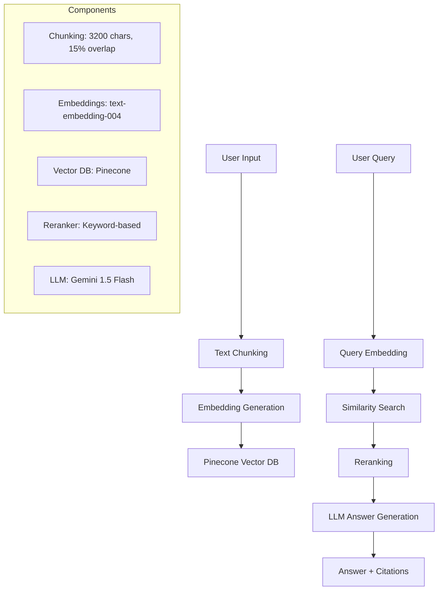

# 🧠 Mini-RAG System

A **Mini Retrieval-Augmented Generation (RAG)** system built with Next.js, Pinecone, and Google Gemini. This application allows users to upload text documents, ask questions about them, and receive AI-powered answers with citations.

## 🔗 Live Demo

**Live URL**: [Coming Soon - Deploy to Vercel]  
**GitHub Repository**: [https://github.com/your-username/mini-rag](https://github.com/your-username/mini-rag)

## 📋 Features

- ✅ **Document Upload**: Paste text directly into the web interface
- ✅ **Smart Chunking**: Configurable text chunking with 15% overlap
- ✅ **Vector Storage**: Cloud-hosted Pinecone vector database
- ✅ **Semantic Search**: Top-K retrieval with similarity search
- ✅ **Reranking**: Simple keyword-based reranking for better relevance
- ✅ **AI Answers**: Google Gemini 1.5 Flash for answer generation
- ✅ **Citations**: Clear source attribution with relevance scores
- ✅ **Real-time Stats**: Processing metrics and token usage estimates
- ✅ **Responsive UI**: Clean, modern interface with dark mode support

## 🏗️ Architecture



### System Components

1. **Frontend**: Next.js 15 with React + TypeScript
2. **Vector Database**: Pinecone (cloud-hosted)
3. **Embeddings**: Google's text-embedding-004
4. **LLM**: Google Gemini 1.5 Flash
5. **Reranker**: Simple keyword-based reranking
6. **Hosting**: Vercel (serverless)

## ⚙️ Configuration

### Chunking Parameters
- **Chunk Size**: 3,200 characters (~800 tokens)
- **Overlap**: 15%
- **Minimum Chunk Size**: 50 characters

### Retrieval Settings
- **Top-K Retrieval**: 8 chunks
- **Reranked Results**: 3 chunks
- **Similarity Threshold**: None (uses top-K)

### Providers Used
- **Vector Database**: Pinecone
- **Embeddings**: Google AI (text-embedding-004)
- **LLM**: Google Gemini 1.5 Flash
- **Hosting**: Vercel

## 🚀 Quick Start

### Prerequisites
- Node.js 18+ 
- Google AI API Key
- Pinecone API Key

### Installation

1. **Clone the repository**
   ```bash
   git clone https://github.com/your-username/mini-rag.git
   cd mini-rag
   ```

2. **Install dependencies**
   ```bash
   npm install
   ```

3. **Set up environment variables**
   ```bash
   cp .env.example .env.local
   ```
   
   Edit `.env.local`:
   ```env
   GOOGLE_API_KEY=your_google_api_key_here
   PINECONE_API_KEY=your_pinecone_api_key_here
   PINECONE_INDEX_NAME=mini-rag-index
   ```

4. **Create Pinecone Index**
   - Log in to [Pinecone Console](https://app.pinecone.io/)
   - Create a new index:
     - Name: `mini-rag-index`
     - Dimensions: `768` (for text-embedding-004)
     - Metric: `cosine`
     - Pod Type: `p1.x1` (starter)

5. **Run the development server**
   ```bash
   npm run dev
   ```

6. **Open the application**
   - Navigate to [http://localhost:3000](http://localhost:3000)

### Usage

1. **Upload Text**: Paste your text content in the upload section
2. **Index Document**: Click "Index Document" to process and store embeddings
3. **Ask Questions**: Use the query section to ask questions about your text
4. **View Results**: Get AI-generated answers with source citations

## 📊 API Endpoints

### POST /api/embed
Index a text document into the vector database.

**Request Body:**
```json
{
  "text": "Your document text here...",
  "source": "document_name.pdf"
}
```

**Response:**
```json
{
  "success": true,
  "message": "Document successfully indexed",
  "stats": {
    "chunksCreated": 5,
    "avgChunkSize": 2800,
    "avgTokens": 750,
    "totalTokens": 3750,
    "vectorsStored": 5
  }
}
```

### POST /api/query
Query the RAG system for answers.

**Request Body:**
```json
{
  "query": "What is the main topic?",
  "topK": 8,
  "rerankTopK": 3
}
```

**Response:**
```json
{
  "success": true,
  "answer": "Based on the provided context...",
  "citations": [
    {
      "source": "user_input",
      "position": 0,
      "text": "Relevant text snippet...",
      "relevanceScore": 0.85
    }
  ],
  "metadata": {
    "totalChunks": 5,
    "retrievedChunks": 8,
    "rerankedChunks": 3,
    "tokensUsed": 450,
    "model": "gemini-1.5-flash",
    "processingTime": 1250
  }
}
```

## 🔧 Development

### Project Structure
```
mini-rag/
├── src/
│   ├── app/
│   │   ├── api/
│   │   │   ├── embed/route.ts
│   │   │   └── query/route.ts
│   │   ├── globals.css
│   │   ├── layout.tsx
│   │   └── page.tsx
│   ├── components/
│   │   ├── AnswerPanel.tsx
│   │   ├── QuerySection.tsx
│   │   ├── StatsPanel.tsx
│   │   └── TextUploadSection.tsx
│   └── lib/
│       ├── chunking.ts
│       ├── embeddings.ts
│       ├── llm.ts
│       ├── rag.ts
│       ├── reranker.ts
│       └── vectorstore.ts
├── .env.example
├── package.json
└── README.md
```

### Available Scripts
- `npm run dev` - Start development server
- `npm run build` - Build for production
- `npm run start` - Start production server
- `npm run lint` - Run ESLint

## 🧪 Minimal Evaluation

### Test Cases
1. **Basic QA**: "What is this document about?"
2. **Specific Details**: "What are the key benefits mentioned?"
3. **Summarization**: "Can you summarize the main points?"
4. **Context Retrieval**: "What does the author say about X?"
5. **Citation Accuracy**: Verify sources are correctly attributed

### Success Metrics
- **Relevance**: Citations should be contextually relevant
- **Accuracy**: Answers should be grounded in the provided text
- **Performance**: Response time < 5 seconds
- **Coverage**: System should handle documents up to ~10,000 words

## 📝 Remarks

### Current Limitations
- **Reranker**: Uses simple keyword matching instead of neural rerankers
- **Chunking**: Fixed character-based chunking (no semantic splitting)
- **Memory**: No conversation history between queries
- **File Upload**: Only supports text pasting (no file upload)
- **Scalability**: Single-user system (no multi-tenancy)

### Free Tier Limits
- **Pinecone**: 1 index, 100K vectors max
- **Google AI**: Rate limits may apply
- **Vercel**: Serverless function timeouts (30s)

### Production Improvements
1. **Enhanced Reranking**: Integrate Cohere Rerank or similar
2. **Semantic Chunking**: Use LLM-based chunking strategies
3. **File Upload**: Support PDF, Word, and other document formats
4. **Authentication**: Add user authentication and document management
5. **Caching**: Implement query result caching
6. **Monitoring**: Add error tracking and performance monitoring
7. **Multi-modal**: Support image and table processing

## 🔐 Environment Variables

Create a `.env.local` file with:

```env
# Required - Google AI API Key
GOOGLE_API_KEY=your_google_api_key_here

# Required - Pinecone Configuration
PINECONE_API_KEY=your_pinecone_api_key_here
PINECONE_INDEX_NAME=mini-rag-index
```

## 📄 License

MIT License - see [LICENSE](LICENSE) file for details.

## 👤 Author

**Your Name**  
- Resume: [Link to your resume]
- GitHub: [@your-username](https://github.com/your-username)
- LinkedIn: [Your LinkedIn Profile]

---

Built with ❤️ using Next.js, Pinecone, and Google Gemini
